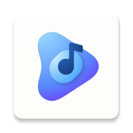

<p align="right">[English](./README.md) | [中文](./README_zh.md)</p>

# XiangsuPlayer 🎵

<p align="center">
  
</p>

<p align="center">
  <strong>A beautiful, feature-rich music player for Android</strong><br>
  Built with Jetpack Compose and Material Design 3
</p>

<p align="center">
    <a href="https://github.com/theovilardo/PixelPlayer/releases/latest">
        
    </a>
    <a href="https://github.com/theovilardo/PixelPlayer/releases">
        
    </a>
    
    
</p>

***

## ‼️ DISCLAIMER

- No fork of this project will receive support. If you use a fork, ask the forker to support you.

***

## ✨ Features

### 🎨 Modern UI/UX

- **Material You** - Dynamic color theming that adapts to your wallpaper
- **Smooth Animations** - Fluid transitions and micro-interactions
- **Customizable UI** - Adjustable corner radius, navigation bar styles, and compact modes
- **Dark/Light Theme** - Automatic or manual theme switching
- **Album Art Colors** - Dynamic color extraction from album artwork
- **Multi-language Support** - 11 languages including English, Chinese, German, French, Korean, Norwegian, Russian, Turkish, Spanish, Italian, Indonesian

### 🎵 Powerful Playback

- **Media3 ExoPlayer** - Industry-leading audio engine with FFmpeg support
- **miniaudio Integration** - High-performance C/C++ audio decoder via JNI for Hi-Fi formats
- **DSD/DFF Support** - Native DSD64/DFF playback with custom transcoding engine
- **USB DAC Output** - Connect external USB DAC for audiophile-quality sound
- **Background Playback** - Full media session integration
- **Queue Management** - Drag-and-drop reordering
- **Shuffle & Repeat** - All playback modes supported
- **Gapless Playback** - Seamless transitions between tracks
- **Custom Transitions** - Configure crossfades between songs
- **ReplayGain Support** - Automatic volume normalization

### 📚 Library Management

- **Multi-format Support** - MP3, FLAC, AAC, OGG, WAV, ALAC, M4A, DSD/DFF, and more
- **Browse By** - Songs, Albums, Artists, Genres, Folders, Playlists
- **Smart Artist Parsing** - Configurable delimiters for multi-artist tracks
- **Album Artist Grouping** - Proper album organization
- **Folder Filtering** - Choose which directories to scan
- **Tag Editor** - Edit metadata with TagLib (MP3, FLAC, M4A support)

### ☁️ Cloud Music Services

- **QQ Music** - Stream from your QQ Music account
- **Netease Cloud Music** - Access your NetEase playlists
- **Bilibili** - Listen to Bilibili audio content
- **Jellyfin** - Full Jellyfin media server integration
- **Navidrome/Subsonic** - Subsonic-compatible server support
- **Telegram** - Browse and play music from Telegram channels
- **Google Drive** - Stream music from your Google Drive
- **Cloud Streaming** - Proxy-based streaming with adaptive quality

### 🤖 AI Integration

- **AI Playlist Generation** - Create playlists with AI (Supports Gemini, Deepseek, OpenAI, Groq, OpenRouter)
- **AI Metadata** - Auto-generate metadata and descriptions
- **AI Playlist Evaluator** - Quality scoring for generated playlists
- **Smart Daily Mix** - AI-powered personalized playlist based on listening habits
- **Usage Analytics** - Track AI token usage with cost reporting

### 🔍 Discovery & Organization

- **Full-text Search** - Search across your entire library with smart filters
- **Daily Mix** - Personalized AI-powered playlists
- **Playlists** - Create and manage custom playlists with drag-and-drop
- **Statistics** - Detailed listening history and habit analytics
- **Smart Playlists** - Rule-based auto-generated playlists
- **Focus Mode** - Pomodoro timer with study/break cycles

### 🎤 Lyrics

- **Synchronized Lyrics** - LRC format via LRCLIB API and Kugou
- **Lyrics Editing** - Modify or add lyrics to your tracks
- **Scrolling Display** - Follow along as you listen
- **Translation Support** - Synchronized translation lyrics
- **Local Lyrics** - Load lyrics from local storage

### 🎚️ Equalizer

- **System Equalizer** - Full parametric EQ control
- **AutoEq Integration** - Automatic equalizer presets for headphones
- **Custom Presets** - Save and load your EQ configurations
- **Genre Presets** - Rock, Pop, Classical, and more

### 🖼️ Artist Artwork

- **Deezer Integration** - Automatic artist images from Deezer API
- **Smart Caching** - Memory (LRU) + database caching for offline access
- **Fallback Icons** - Beautiful genre-based placeholders when images unavailable
- **Color Extraction** - Dynamic colors from album artwork

### 📲 Connectivity

- **Chromecast** - Stream to your TV or smart speakers
- **Android Auto** - Full Android Auto support for in-car playback
- **Widgets** - Home screen controls with Glance widgets (4x1, 4x2)
- **Bluetooth** - Bluetooth audio device support
- **Web Remote** - Control playback from browser via HTTP server

### 💾 Backup & Restore

- **Full Backup** - Export all settings, playlists, and library data
- **Selective Restore** - Choose which modules to restore
- **Cloud Backup** - Backup to cloud storage services

### ⚙️ Advanced Features

- **Batch Operations** - Multi-select for queue, share, and like
- **Format Converter** - Transcode audio formats (DFF→WAV, etc.)
- **Queue Share** - Share playlists via M3U files
- **Gesture Controls** - Swipe and gesture-based navigation
- **Developer Options** - Advanced settings for power users

***

## 🛠️ Tech Stack

| Category               | Technology                                                                           |
| ---------------------- | ------------------------------------------------------------------------------------ |
| **Language**           | [Kotlin](https://kotlinlang.org/) 100%                                               |
| **UI Framework**       | [Jetpack Compose](https://developer.android.com/jetpack/compose)                     |
| **Design System**      | [Material Design 3](https://m3.material.io/) + Google Sans Rounded                   |
| **Audio Engine**       | [Media3 ExoPlayer](https://developer.android.com/guide/topics/media/media3) + FFmpeg |
| **Hi-Fi Decoder**      | [miniaudio](https://github.com/mackron/miniaudio) (C/C++ JNI)                        |
| **Architecture**       | MVVM with StateFlow/SharedFlow                                                       |
| **DI**                 | [Hilt](https://dagger.dev/hilt/)                                                     |
| **Database**           | [Room](https://developer.android.com/training/data-storage/room)                     |
| **Preferences**        | [DataStore](https://developer.android.com/topic/libraries/architecture/datastore)    |
| **Networking**         | [Retrofit](https://square.github.io/retrofit/) + OkHttp                              |
| **Image Loading**      | [Coil](https://coil-kt.github.io/coil/)                                              |
| **JSON Serialization** | [Kotlinx Serialization](https://kotlinlang.org/docs/serialization.html)              |
| **Async**              | Kotlin Coroutines & Flow                                                             |
| **Background Tasks**   | WorkManager                                                                          |
| **Metadata**           | [TagLib](https://github.com/nicholaus/taglib-android)                                |
| **Widgets**            | [Glance](https://developer.android.com/jetpack/compose/glance)                       |
| **AI Providers**       | Gemini, Deepseek, OpenAI, Groq, OpenRouter                                           |
| **Audio Analysis**     | [AutoEq](https://github.com/jaakkopasanen/AutoEq) presets                            |

***

## 📱 Requirements

- **Android 11** (API 30) or higher
- **6GB RAM** recommended for smooth performance
- **USB OTG** required for USB DAC support

***

## 🚀 Getting Started

### Prerequisites

- Android Studio Ladybug | 2024.2.1 or newer
- Android SDK 37+
- JDK 21+
- NDK (for miniaudio JNI compilation)

### Installation

1. **Clone the repository**
   ```sh
   git clone https://github.com/theovilardo/PixelPlayer.git
   cd PixelPlayer
   ```
2. **Open in Android Studio**
   - Open Android Studio
   - Select "Open an Existing Project"
   - Navigate to the cloned directory
3. **Sync and Build**
   - Wait for Gradle to sync dependencies
   - Build the project (Build → Make Project)
   - Note: First build may take time for NDK compilation
4. **Run**
   - Connect a device or start an emulator
   - Click Run (▶️)

### Building Variants

```sh
# Debug build
./gradlew assembleDebug

# Release build (requires signing config)
./gradlew assembleRelease

# Benchmark build (ABI-split)
./gradlew assembleBenchmark
```

***

## ⬇️ Download

<p align="center">
  <a href="https://github.com/theovilardo/PixelPlayer/releases/latest">
    
  </a>
</p>

<p align="center">
  <a href="https://apps.obtainium.imranr.dev/redirect?r=obtainium://app/%7B%22id%22%3A%22com.theveloper.pixelplay%22%2C%22url%22%3A%22https%3A%2F%2Fgithub.com%2Ftheovilardo%2FPixelPlayer%22%2C%22autho[...]">
    
  </a>
</p>

***

## 🌐 Languages & Localization

PixelPlayer supports **10+ languages** out of the box:

| Language  | Code   | Status     |
| --------- | ------ | ---------- |
| English   | en     | ✅ Complete |
| 简体中文      | zh-rCN | ✅ Complete |
| Deutsch   | de     | ✅ Complete |
| Français  | fr     | ✅ Complete |
| 한국어       | ko     | ✅ Complete |
| Norsk     | nb     | ✅ Complete |
| Русский   | ru     | ✅ Complete |
| Türkçe    | tr     | ✅ Complete |
| Español   | es     | ✅ Complete |
| Italiano  | it     | ✅ Complete |
| Indonesia | in     | ✅ Complete |

Want to contribute a translation? See the [Contributing](#-contributing) section.

***

## 📂 Project Structure

```
app/src/main/java/com/theveloper/pixelplay/
├── data/
│   ├── ai/               # AI integration (playlists, metadata, handlers)
│   │   ├── provider/     # AI provider implementations (Gemini, Deepseek, etc.)
│   │   └── system/       # AI system prompt engineering
│   ├── backup/           # Backup and restore management
│   ├── bilibili/         # Bilibili API integration
│   ├── database/        # Room entities, DAOs, migrations
│   ├── dot/              # Direct-On-Dot screen renderer
│   ├── gdrive/           # Google Drive API integration
│   ├── github/           # GitHub update checker
│   ├── lx/               # LxMusic (QQ Music) integration
│   ├── media/            # Media processing (ReplayGain, caching)
│   ├── model/            # Domain models (Song, Album, Artist, SortOption, etc.)
│   ├── netease/          # NetEase Cloud Music API
│   ├── playlist/         # M3U playlist management
│   ├── preferences/     # DataStore preferences
│   ├── qq/               # QQ Music search API
│   ├── service/          # MusicService, USB DAC manager
│   ├── stream/           # Cloud streaming proxy
│   └── worker/           # WorkManager sync workers
├── di/                   # Hilt dependency injection modules
├── presentation/
│   ├── components/       # Reusable Compose components
│   ├── equalizer/        # Equalizer screen and components
│   ├── focusmode/        # Focus mode (Pomodoro timer)
│   ├── library/          # Library tab implementations
│   ├── navigation/       # Navigation graph
│   ├── player/           # Player UI components
│   ├── screens/          # Screen composables
│   ├── stats/            # Listening statistics screens
│   └── viewmodel/        # ViewModels
├── ui/
│   ├── glancewidget/     # Home screen widgets
│   └── theme/            # Colors, typography, theming
└── utils/
    ├── AudioDecoder.kt   # Custom audio decoder
    ├── DffDecoder.kt     # DFF/DSD decoder with transcoding
    ├── HiFiExtractorsFactory.kt  # Hi-Fi format extractor
    ├── TranscodeCacheManager.kt  # Transcoding cache management
    └── Extensions.kt     # Kotlin extensions
```

***

## 📱 Supported Audio Formats

| Format     | Extension      | Support Level       |
| ---------- | -------------- | ------------------- |
| MP3        | `.mp3`         | ✅ Full              |
| FLAC       | `.flac`        | ✅ Full              |
| AAC        | `.aac`, `.m4a` | ✅ Full              |
| OGG Vorbis | `.ogg`         | ✅ Full              |
| WAV        | `.wav`         | ✅ Full              |
| ALAC       | `.m4a`         | ✅ Full              |
| DSD64      | `.dff`, `.dsf` | ✅ Transcoded to PCM |
| MIDI       | `.mid`         | ✅ Basic             |
| Opus       | `.opus`        | ✅ Full              |
| WMA        | `.wma`         | ⚠️ Partial          |

***

## 🤝 Contributing

Contributions are welcome! Please feel free to submit a Pull Request.

### How to Contribute

1. **Fork the Project**
   ```sh
   git clone https://github.com/your-username/PixelPlayer.git
   cd PixelPlayer
   ```
2. **Create your Feature Branch**
   ```sh
   git checkout -b feature/AmazingFeature
   ```
3. **Commit your Changes**
   ```sh
   git commit -m 'Add some AmazingFeature'
   ```
4. **Push to the Branch**
   ```sh
   git push origin feature/AmazingFeature
   ```
5. **Open a Pull Request**

### Reporting Issues

When reporting issues, please include:

- Device model and Android version
- PixelPlayer version
- Steps to reproduce
- Expected behavior vs actual behavior
- Logs or screenshots if applicable

***

## 🔗 Links

- [GitHub Issues](https://github.com/theovilardo/PixelPlayer/issues)
- [Feature Requests](https://github.com/theovilardo/PixelPlayer/issues/new?template=feature_request.yml)
- [Bug Reports](https://github.com/theovilardo/PixelPlayer/issues/new?template=bug_report.yml)

***

## 📄 License

This project is licensed under a Proprietary License - see the [LICENSE](LICENSE) file for details.

***

<p align="center">
  Made with ❤️ by <a href="https://github.com/theovilardo">theovilardo</a>
</p>
